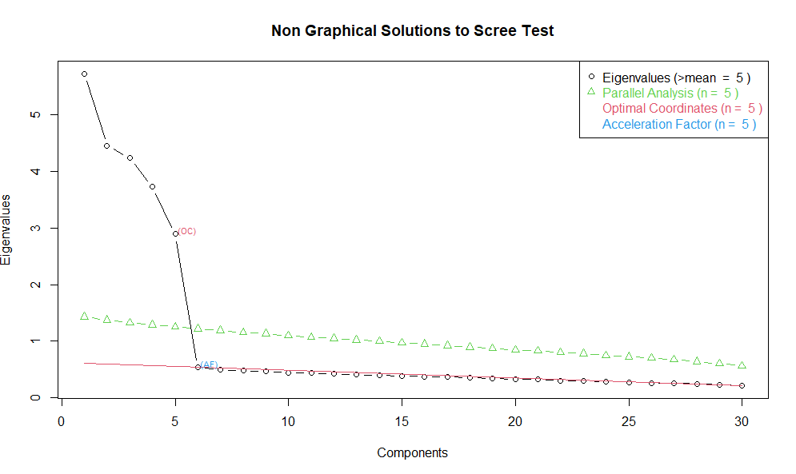

# globaltech-employee-efa-analysis

## Overview

This project conducts an Exploratory Factor Analysis (EFA) on
GlobalTech's employee survey data to identify the underlying dimensions
of employee attitudes and experiences.

The survey includes 500 employees and 30 Likert-scale items (1--7)
measuring engagement, satisfaction, leadership, innovation, and
organizational connection.

The goal is to uncover the latent factor structure to inform HR strategy
and organizational decision-making.

------------------------------------------------------------------------

## Objectives

-   Determine the number of underlying factors\
-   Extract and rotate factors for interpretability\
-   Interpret factor structure\
-   Provide actionable insights for HR

------------------------------------------------------------------------

## Data Description

-   Sample size: 500 employees\
-   Items: 30 questions (Q01--Q30)\
-   Scale: 7-point Likert (1 = Strongly Disagree, 7 = Strongly Agree)\
-   Missing data: None detected

------------------------------------------------------------------------

# Factor Determination

Parallel Analysis and Scree Plot inspection indicated that five factors
should be retained.

------------------------------------------------------------------------

# Factor Extraction & Rotation

-   Extraction Method: Principal Component Analysis (PCA)\
-   Rotation: Varimax\
-   Loading cutoff: 0.40

Varimax rotation improved interpretability by maximizing variance
explained within each factor.

------------------------------------------------------------------------

# Factor Structure

## Factor 1: Team Innovation

Items: Q13--Q18\
Focus: Openness to change, creativity, risk-taking, implementation of
new ideas.

## Factor 2: Employee Engagement

Items: Q07--Q12\
Focus: Energy, enthusiasm, immersion, emotional involvement in work.

## Factor 3: Organizational Commitment

Items: Q25--Q30\
Focus: Belonging, loyalty, pride, long-term retention intention.

## Factor 4: Job Satisfaction

Items: Q01--Q06\
Focus: Meaningfulness, accomplishment, skill utilization, role
satisfaction.

## Factor 5: Leadership Support

Items: Q19--Q24\
Focus: Feedback, supervisor support, trust in leadership, communication.

------------------------------------------------------------------------

# Variance Explained

The five-factor solution accounts for 70.1% of total variance,
indicating strong dimensional structure.

------------------------------------------------------------------------

# HR Implications

-   Enables targeted engagement and innovation initiatives
-   Separates job satisfaction from organizational commitment
-   Allows independent evaluation of leadership effectiveness
-   Supports data-driven workforce strategy

------------------------------------------------------------------------

# Technical Summary

-   Method: Exploratory Factor Analysis
-   Extraction: PCA
-   Rotation: Varimax
-   Factors retained: 5
-   Variance explained: 70.1%
-   Sample size: 500

------------------------------------------------------------------------

# Conclusion

Employee attitudes at GlobalTech are structured across five clear
dimensions: Team Innovation, Employee Engagement, Organizational
Commitment, Job Satisfaction, and Leadership Support.

This structure provides a foundation for evidence-based HR
decision-making and strategic workforce development.
